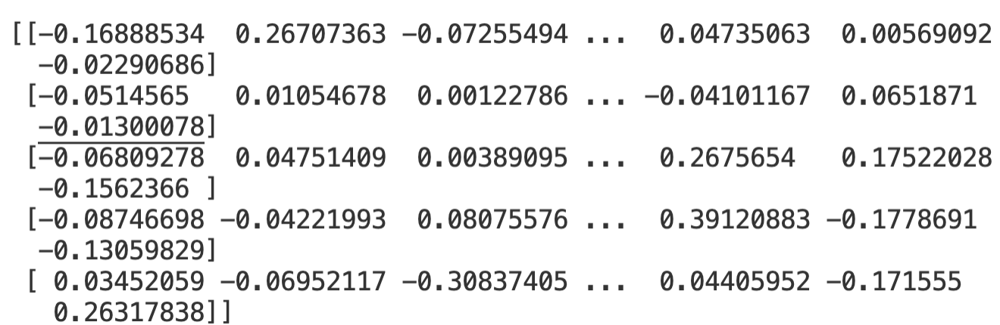
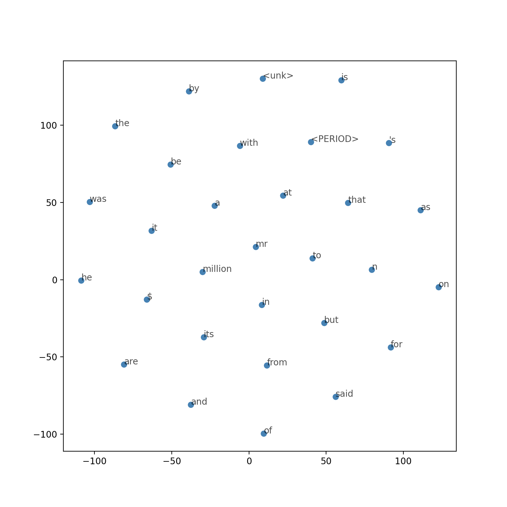
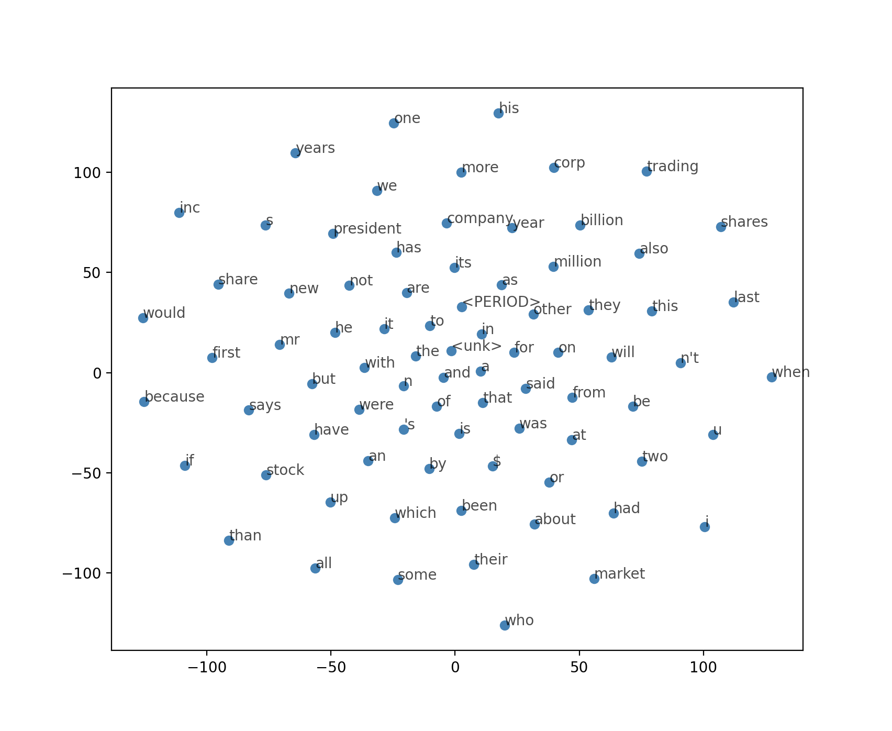
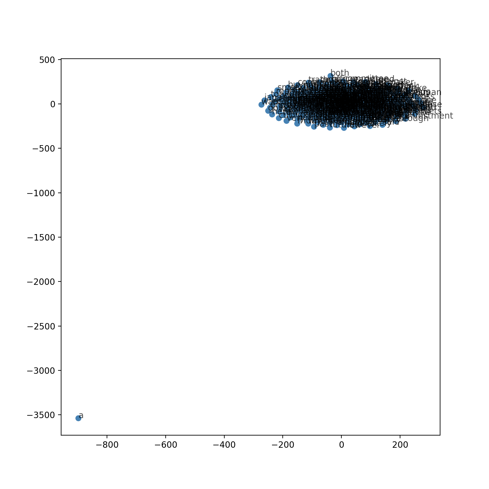

## NLP05-Core-09作业
- 基于skip-gram或者CBOW实现一个简单的word2vec
可以使用的数据集：Penn Tree bank
Pytorch封装了很好的Penn Tree Bank Dataloader作为参考：https://pytorchnlp.readthedocs.io/en/latest/_modules/torchnlp/datasets/penn_treebank.html
- 利用你训练的word2vec完成以下任务
利用上一张知识对词向量进行聚类，你可以考虑混合高斯、kmeans，查看聚类性如何，画出词云
输入一个单词，进行同义词挖掘

## 作业代码介绍
- 采用Pytorch封装了很好的Penn Tree Bank Dataloader下载相应的ptb数据存储在data/ptb-treebank/文件夹中，然后对该文件夹中的ptb.train.txt数据进行训练并提取词向量

```python
import os
import io
import utils

import torch
from torch import nn
import torch.optim as optim

from collections import Counter
import random
import numpy as np

import matplotlib.pyplot as plt
from sklearn.manifold import TSNE

from torchnlp.download import download_files_maybe_extract
from torchnlp.encoders.text import DEFAULT_EOS_TOKEN
from torchnlp.encoders.text import DEFAULT_UNKNOWN_TOKEN


def penn_treebank_dataset(
    directory='data/penn-treebank',
    train=False,
    dev=False,
    test=False,
    train_filename='ptb.train.txt',
    dev_filename='ptb.valid.txt',
    test_filename='ptb.test.txt',
    check_files=['ptb.train.txt'],
    urls=[
        'https://raw.githubusercontent.com/wojzaremba/lstm/master/data/ptb.train.txt',
        'https://raw.githubusercontent.com/wojzaremba/lstm/master/data/ptb.valid.txt',
        'https://raw.githubusercontent.com/wojzaremba/lstm/master/data/ptb.test.txt'
    ],
    unknown_token=DEFAULT_UNKNOWN_TOKEN,
    eos_token=DEFAULT_EOS_TOKEN):

    download_files_maybe_extract(urls=urls, directory=directory, check_files=check_files)

    ret = []
    splits = [(train, train_filename), (dev, dev_filename), (test, test_filename)]
    splits = [f for (requested, f) in splits if requested]
    for filename in splits:
        full_path = os.path.join(directory, filename)
        text = []
        with io.open(full_path, encoding='utf-8') as f:
            for line in f:
                text.extend(line.replace('<unk>', unknown_token).split())
                text.append(eos_token)
        ret.append(text)

    if len(ret) == 1:
        return ret[0]
    else:
        return tuple(ret)
```

- 通过以上的penn_treebank_dataset()导入ptb数据集并放入data/penn-treebank文件夹中
```python
penn_treebank_dataset()
```

- 从data/penn-treebank文件夹中的ptb.train.txt读取数据

```python
with open('./data/penn-treebank/ptb.train.txt') as f_ptb_train:
    text_ptb_train = f_ptb_train.read()

words = utils.preprocess(text_ptb_train)
print(words[:30]) 
# 打印出前30个词语如下 ['pierre', '<unk>', 'n', 'years', 'old', 'will', 'join', 'the', 'board', 'as', 'a', 'nonexecutive', 'director', 'nov', '<PERIOD>', 'n', 'mr', '<PERIOD>', '<unk>', 'is', 'chairman', 'of', '<unk>', 'n', '<PERIOD>', 'v', '<PERIOD>', 'the', 'dutch', 'publishing']

```

- 建立utils.py，构造通用预处理preprocess和建立查找表create_lookup_tables函数

```python
import re
from collections import Counter

def preprocess(text):

    # 在模型中将分隔符替换为具有特定意义的标签，方便后续的NLP任务处理。
    text = text.lower()
    text = text.replace('.', ' <PERIOD> ')
    text = text.replace(',', ' <COMMA> ')
    text = text.replace('"', ' <QUOTATION_MARK> ')
    text = text.replace(';', ' <SEMICOLON> ')
    text = text.replace('!', ' <EXCLAMATION_MARK> ')
    text = text.replace('?', ' <QUESTION_MARK> ')
    text = text.replace('(', ' <LEFT_PAREN> ')
    text = text.replace(')', ' <RIGHT_PAREN> ')
    text = text.replace('--', ' <HYPHENS> ')
    text = text.replace('?', ' <QUESTION_MARK> ')
    # text = text.replace('\n', ' <NEW_LINE> ')
    text = text.replace(':', ' <COLON> ')
    words = text.split()
    
    # 去除出现次数不超过5次的低频词
    word_counts = Counter(words)
    trimmed_words = [word for word in words if word_counts[word] > 5]

    return trimmed_words


def create_lookup_tables(words):
    """
    Create lookup tables for vocabulary
    :param words: Input list of words
    :return: Two dictionaries, vocab_to_int, int_to_vocab
    """
    word_counts = Counter(words)
   
    # 将单词按照出现频次从高到低进行排序
    sorted_vocab = sorted(word_counts, key=word_counts.get, reverse=True)
    #  dictionaries 建立int_to_vocab字典
    
    int_to_vocab = {ii: word for ii, word in enumerate(sorted_vocab)}
    vocab_to_int = {word: ii for ii, word in int_to_vocab.items()}

    return vocab_to_int, int_to_vocab
```
  
- 在utils.py中，通过建立查找表的函数create_lookup_tables得到两个字典，一个字典是将词语映射到出现ID号码，另一个是将ID号码返回到词语本身。ID 号码的大小是根据出现频次大小来逆序排列的，例如the出现次数最多，则编号为0,出现次数次多的则编号为1，依此类推。

```python
vocab_to_int, int_to_vocab = utils.create_lookup_tables(words)
int_words = [vocab_to_int[word] for word in words]

# print(int_words[:30])
# 对应于前30个单词的相应编号为[8510, 1, 2, 74, 394, 33, 2113, 0, 147, 19, 5, 8511, 276, 409, 8, 2, 23, 8, 1, 13, 142, 3, 1, 2, 8, 2460, 8, 0, 3047, 1584]
```

- 二次采样，对于“the”，“of”以及“for”这类过高频词，对上下文的信息贡献并不是很大，去除这些过高频词有助于提升训练速度。其公式如下所示$P(w^{i}) = 1 - \sqrt{\frac{t}{f(w_{i})}}$，其中t表示阈值参数，f表示单词频数，P表示该单词被去除的概率

```python
threshold = 1e-5
word_counts = Counter(int_words)
# print(list(word_counts.items())[0]) 

total_count = len(int_words)
freqs = {word: count/total_count for word, count in word_counts.items()}
p_drop = {word: 1 - np.sqrt(threshold/freqs[word]) for word in word_counts}
# 通过二次下采样公式去除相关的高频词，得到新的训练集词语列表
train_words = [word for word in int_words if random.random() < (1 - p_drop[word])]

# print(train_words[:30])
# 新的词语ID号码有所改变，如下所示，可以看出相关的the等过高频词已经去除 [8510, 19, 8511, 8, 3, 2460, 3047, 7185, 2461, 2154, 8511, 439, 3647, 3133, 4, 5848, 4204, 5849, 30, 4047, 3133, 7186, 6679, 114, 2641, 7771, 2462, 2973, 2575, 5848]
# print(len(Counter(train_words))) 

```

- 在使用skip-gram结构之前，需要明确传入网络的词语批次batch，需要定义窗口的大小以及窗口范围内的词语列表。

```python

def get_target(words, idx, window_size=5):
    ''' Get a list of words in a window around an index. '''
    
    R = np.random.randint(1, window_size+1)
    start = idx - R if (idx - R) > 0 else 0
    stop = idx + R
    target_words = words[start:idx] + words[idx+1:stop+1]
    
    return list(target_words)

int_text = [i for i in range(10)]
print('Input: ', int_text)
idx=5 # 对词语进行测试，查看某个固定的单词附近，如果随机选取5个词语范围之内的窗口，是否可以得到附近的词语ID

target = get_target(int_text, idx=idx, window_size=5)
print('Target: ', target) 
# 通过Target我们进行了两侧尝试，一次得到的是[4,6]，这是窗口大小为1的情形，一次得到的是[3, 4, 6, 7]，这是窗口大小为3的情形。
# (TF2-Torch) libo@libos-MacBook-Pro lesson09 % python3 Core_lesson09.py
# Input:  [0, 1, 2, 3, 4, 5, 6, 7, 8, 9]
# Target:  [4, 6]
# (TF2-Torch) libo@libos-MacBook-Pro lesson09 % python3 Core_lesson09.py
# Input:  [0, 1, 2, 3, 4, 5, 6, 7, 8, 9]
# Target:  [3, 4, 6, 7]

# 获取批次数据batch data，利用以上的get_target函数恢复目标上下文的窗口内词语


def get_batches(words, batch_size, window_size=5):
    ''' Create a generator of word batches as a tuple (inputs, targets) '''
    
    n_batches = len(words)//batch_size
    
    # 全batch
    words = words[:n_batches*batch_size]
    
    for idx in range(0, len(words), batch_size):
        x, y = [], []
        batch = words[idx:idx+batch_size]
        for ii in range(len(batch)):
            batch_x = batch[ii]
            batch_y = get_target(batch, ii, window_size)
            y.extend(batch_y)
            x.extend([batch_x]*len(batch_y))
        yield x, y

int_text = [i for i in range(20)]
x,y = next(get_batches(int_text, batch_size=4, window_size=5))

# 通过cosine_similarity计算词向量的相似度

def cosine_similarity(embedding, valid_size=16, valid_window=100, device='cpu'):
    """ Returns the cosine similarity of validation words with words in the embedding matrix.
        Here, embedding should be a PyTorch embedding module.
    """
    
    
    # sim = (a . b) / |a||b|

    #这里随机抽取一些单词，通过cosine similarity计算与这些单词关系最近的单词
    
    embed_vectors = embedding.weight
    
    # 嵌入向量的大小 |b|
    magnitudes = embed_vectors.pow(2).sum(dim=1).sqrt().unsqueeze(0)
    
 
    # 从(0, window) 和（1000， 1000+window）范围内随机挑选N个单词
    valid_examples = np.array(random.sample(range(valid_window), valid_size//2))
    valid_examples = np.append(valid_examples,random.sample(range(1000,1000+valid_window), valid_size//2))
    valid_examples = torch.LongTensor(valid_examples).to(device)
    
    valid_vectors = embedding(valid_examples)
    similarities = torch.mm(valid_vectors, embed_vectors.t())/magnitudes
        
    return valid_examples, similarities

class SkipGramNeg(nn.Module):
    def __init__(self, n_vocab, n_embed, noise_dist=None):
        super().__init__()
        
        self.n_vocab = n_vocab
        self.n_embed = n_embed
        self.noise_dist = noise_dist
        
        # 为输入和输出单词定义嵌入层
        self.in_embed = nn.Embedding(n_vocab,n_embed)
        self.out_embed = nn.Embedding(n_vocab,n_embed)
        

        # 按照均匀分布对嵌入表格进行初始化
        
    def forward_input(self, input_words):
        # 返回输入词嵌入向量
        input_vectors = self.in_embed(input_words)
        return input_vectors
    
    def forward_output(self, output_words):
        # 返回输出词嵌入向量
        output_vectors = self.out_embed(output_words)
        return output_vectors
    
    def forward_noise(self, batch_size, n_samples):
        """ Generate noise vectors with shape (batch_size, n_samples, n_embed)"""
        if self.noise_dist is None:
            # 平均采样单词
            noise_dist = torch.ones(self.n_vocab)
        else:
            noise_dist = self.noise_dist
            
        # 从噪声分布中采样单词

        noise_words = torch.multinomial(noise_dist,batch_size * n_samples, replacement=True)
        
        device = "cuda" if model.out_embed.weight.is_cuda else "cpu"
        noise_words = noise_words.to(device)
        
        
        noise_vectors = self.out_embed(noise_words).view(batch_size,n_samples,self.n_embed)
        
        return noise_vectors

class NegativeSamplingLoss(nn.Module):
    def __init__(self):
        super().__init__()

    def forward(self, input_vectors, output_vectors, noise_vectors):
        
        batch_size, embed_size = input_vectors.shape
        
        #  输入的词向量需要是完整词的列向量
        input_vectors = input_vectors.view(batch_size, embed_size, 1)
        
        # 输出的词向量需要是完整词的行向量
        output_vectors = output_vectors.view(batch_size, 1, embed_size)
        
        # bmm = batch matrix multiplication
        #  正确的log-sigmoid损失函数
        out_loss = torch.bmm(output_vectors, input_vectors).sigmoid().log()
        out_loss = out_loss.squeeze()
        
        # 不正确的log-sigmoid损失函数
        noise_loss = torch.bmm(noise_vectors.neg(), input_vectors).sigmoid().log()
        noise_loss = noise_loss.squeeze().sum(1)  # 在噪声向量样本上将损失值相加

        # 获取平均的batch损失函数
        return -(out_loss + noise_loss).mean()


device = 'cuda' if torch.cuda.is_available() else 'cpu'

# 获取噪声分布

word_freqs = np.array(sorted(freqs.values(), reverse=True))
unigram_dist = word_freqs/word_freqs.sum()
noise_dist = torch.from_numpy(unigram_dist**(0.75)/np.sum(unigram_dist**(0.75)))

# 模型初始化
embedding_dim = 300
model = SkipGramNeg(len(vocab_to_int), embedding_dim, noise_dist=noise_dist).to(device)

# 使用定义好的损失函数
criterion = NegativeSamplingLoss() 
optimizer = optim.Adam(model.parameters(), lr=0.003)

print_every = 1500
steps = 0
epochs = 80

# train for some number of epochs
for e in range(epochs):
    # get our input, target batches
    for input_words, target_words in get_batches(train_words, 512):
        steps += 1
        inputs, targets = torch.LongTensor(input_words), torch.LongTensor(target_words)
        inputs, targets = inputs.to(device), targets.to(device)
        
        # input, outpt, and noise vectors
        input_vectors = model.forward_input(inputs)
        output_vectors = model.forward_output(targets)
        noise_vectors = model.forward_noise(inputs.shape[0], 5)

        # negative sampling loss
        loss = criterion(input_vectors, output_vectors, noise_vectors)

        optimizer.zero_grad()
        loss.backward()
        optimizer.step()

        # loss stats
        if steps % print_every == 0:
            print("Epoch: {}/{}".format(e+1, epochs))
            print("Loss: ", loss.item()) # avg batch loss at this point in training
            valid_examples, valid_similarities = cosine_similarity(model.in_embed, device=device)
            _, closest_idxs = valid_similarities.topk(6)

            valid_examples, closest_idxs = valid_examples.to('cpu'), closest_idxs.to('cpu')
            for ii, valid_idx in enumerate(valid_examples):
                closest_words = [int_to_vocab[idx.item()] for idx in closest_idxs[ii]][1:]
                print(int_to_vocab[valid_idx.item()] + " | " + ', '.join(closest_words))
            print("...\n")
```

- 构造词嵌入矩阵embedding

```python
embeddings = model.in_embed.weight.to('cpu').data.numpy()
print(embeddings[:5])
```

- 词嵌入矩阵可以通过前5个数据来参考，如下所示：


- 建立80个epoch进行训练的过程如下所示：

```
Epoch: 5/80
Loss:  13.879170417785645
also | enthusiastic, flawed, seeds, setting, steppenwolf
year | dow, consideration, parity, secretaries, meant
but | metals, boat, breeding, submitted, might
could | providing, previously, speed, scare, journal
business | organizations, benefited, stars, socialism, per-share
are | electronic, luxury-car, deloitte, volume, indexes
<PERIOD> | ordered, kitchen, occasions, curb, concrete
an | notion, damage, feels, avoid, pfeiffer
george | christie, scott, networks, ounces, split
won | court, anyone, discarded, jeopardize, pump
exports | james, dates, schaeffer, sank, actually
per | drop, tickets, demand, cases, four-year-old
evidence | commodore, false, \*, dictator, omni
questions | liquor, here, eastman, bullet, maintenance
age | unity, spy, discretionary, maintaining, brewing
earned | first, began, forum, fm, accelerate
...

Epoch: 10/80
Loss:  7.1109747886657715
or | saved, ldp, attack, healthvest, manner
are | electronic, saying, luxury-car, deloitte, indexes
other | level, beat, status, tesoro, bros
into | discovery, weekes, du, removed, rape
with | losses, dean, full-year, as, succeeded
first | international, latest, mitsubishi, demonstrations, earned
only | ibm, mason, jets, selling, television
million | l, franchisee, acting, slim, experimental
regulators | offenders, chances, low-income, competitor, prepayment
jumped | quotations, bushel, brings, improving, mehl
article | exclusion, soviet, receivables, nearly, midwest
let | independent, convinced, comparisons, single-a-1, ending
sector | year-to-year, n't, knew, arias, wedge
source | technique, similar, study, detail, trust
delivery | lotus, imagine, meals, passenger, kellogg
questions | liquor, matters, bullet, antar, eastman
...

Epoch: 14/80
Loss:  4.397855758666992
could | speed, providing, cells, scare, movies
billion | n, strategic, fiscal, board, year
$ | n, said, up, <PERIOD>, to
would | manuel, department, stake, franc, horizon
than | quarter, newspaper, sachs, women, delmed
mr | of, privilege, to, perfectly, slipping
stock | top, finished, closed, n, pat
i | litigation, critics, defendants, brown-forman, many
himself | boveri, anne, internationally, testing, evaluation
delivery | lotus, imagine, meals, kellogg, europe
environmental | bougainville, registration, slide, pervasive, arms
resources | tougher, forgotten, acknowledged, solutions, holds
housing | bergsma, partial, rhone-poulenc, armco, sports
owned | colgate, half, mrs, bullets, professional
quake | shack, dropped, speaks, achievement, lighting
let | comparisons, convinced, ending, independent, minpeco
...

Epoch: 19/80
Loss:  2.853670597076416
has | the, in, <unk>, he, to
not | the, <unk>, that, some, in
it | the, of, to, in, <unk>
his | the, it, what, that, colleagues
stock | top, finished, n, closed, on
such | u, that, information, three, was
when | city, studies, operation, a, group
said | to, the, and, of, $
per | shares, enjoying, ending, kane, sheets
block | harris, equivalents, wants, assessed, upgraded
irs | 1970s, punish, holders, r, shearson
water | midsized, chivas, deukmejian, inserted, achievement
side | jeopardize, deadline, hooker, luxury, built
brand | uncertainties, gambling, thought, reformers, differences
crash | machinists, malcolm, terrible, destroying, deflator
earned | cut, adjusting, first, vacuum, volatility
...

Epoch: 23/80
Loss:  2.272655963897705
years | the, its, said, <unk>, 's
corp | <PERIOD>, shares, business, equipment, will
are | to, <unk>, and, is, in
group | announced, raise, when, garratt, or
other | to, 's, and, a, <PERIOD>
not | the, <unk>, a, to, some
because | the, in, that, <unk>, and
this | <unk>, to, that, the, and
size | environments, power, program-trading, southam, sharon
brothers | searched, technology, deficits, coats, st
directly | doldrums, sinyard, contract, takes, vice
pilots | ride, defer, judgments, developed, itself
hurt | preparation, narrowly, last, alarmed, file
light | teagan, luxury, daikin, audio, apple
created | overseeing, reduces, minn, philosophy, glossy
himself | internationally, myself, boveri, cox, privileges
...

Epoch: 28/80
Loss:  1.9521111249923706
years | the, 's, said, a, <PERIOD>
it | the, of, <unk>, that, to
n't | <unk>, and, that, has, the
one | a, the, that, of, <unk>
were | and, the, <unk>, of, that
at | a, in, and, to, n
for | and, to, <unk>, in, that
<PERIOD> | <unk>, and, the, to, a
seem | last, specified, eager, displayed, highway
minister | japan, constraints, president, latin, destroy
kidder | peabody, faith, bankers, shareholder, bull
hopes | ibm, insist, shareholder, presumed, operational
housing | govern, billion, areas, rhone-poulenc, defined
owned | colgate, development, professional, clause, follows
sector | year-to-year, gained, mit, harmony, narrowing
france | under, jolla, february, shirts, phase
...

Epoch: 33/80
Loss:  1.5162761211395264
year | n, million, billion, <PERIOD>, to
do | come, all, are, is, i
can | but, they, in, when, analysts
$ | n, million, a, billion, said
years | <unk>, the, <PERIOD>, a, 's
president | vice, <PERIOD>, director, we, an
the | <unk>, to, of, in, and
all | but, of, for, a, <unk>
resources | acknowledged, vacancy, reduces, tougher, holds
conditions | del, invest, standpoint, n, tactics
thrift | punishment, loan-loss, quiet, expires, spoken
tons | treasury, consecutive, instrument, productions, confirms
cbs | cable, designer, angeles, strongly, surveyed
questions | antar, told, panic, suitors, supreme
sent | them, not, that, notably, portable
minister | japan, later, president, constraints, destroy
...

Epoch: 37/80
Loss:  1.5985873937606812
<unk> | the, a, to, and, as
such | the, <unk>, we, to, that
that | the, a, <unk>, of, to
u | s, the, a, of, to
are | to, <unk>, and, is, in
company | and, said, of, $, the
up | a, <unk>, $, from, and
first | item, million, earlier, from, judge
red | stadiums, status, utah, speaks, copying
minimum | places, h, inaccurate, ingersoll, renewal
bankruptcy | creditor, australia, creditors, considerations, chapter
article | bnl, massachusetts, retains, fierce, expenditure
evidence | cia, discrimination, dictator, navy, false
pilots | insistence, mediator, unions, ual, dayton
overseas | mortgage, largest, main, partial, suspend
difficult | scenario, spreading, collection, bigger, only
...

Epoch: 42/80
Loss:  1.4107446670532227
a | <unk>, the, to, and, that
because | the, in, and, many, that
two | of, in, and, to, by
some | the, <unk>, that, it, not
by | <unk>, the, a, of, and
if | with, into, for, they, that
when | away, city, studies, a, not
on | the, that, <unk>, in, to
media | salinas, tokyo, montedison, ad, superior
minimum | h, places, ingersoll, inaccurate, market
brothers | searched, compared, technology, salomon, japanese
game | bobby, ball, probing, bougainville, anytime
directly | established, discount, personal-computer, source, difference
cancer | genes, colon, gene, lung, cells
smaller | ocean, compensation, just, rebounded, easily
himself | featuring, privileges, campbell, ad, boveri
...

Epoch: 46/80
Loss:  1.428306221961975
is | of, the, to, that, in
no | economy, our, says, again, has
new | the, of, york, such, n
may | n, filling, now, n't, miles
some | that, the, <unk>, itself, it
are | to, and, not, <unk>, in
years | the, <unk>, a, as, is
mr | of, <unk>, that, in, <PERIOD>
tons | instrument, softness, stream, consecutive, curtail
digital | mainframes, tandem, mainframe, computers, manufacturers
apparently | endure, poorly, smart, labor, hasbro
hugo | hurricane, relief, damage, carolinas, fabrication
preferred | dlj, paying, quarterly, apogee, developed
cbs | cable, designer, florio, advertisers, cities\/abc
attempt | greenberg, pledge, committees, states, meantime
sharply | expenditures, joint-venture, ozone, marous, carbon
...

Epoch: 51/80
Loss:  1.4416804313659668
last | financial, a$, <PERIOD>, close, results
than | threatening, moved, more, earlier, owners
if | with, asks, they, say, san
on | the, that, <unk>, have, was
an | that, from, and, of, the
can | but, adds, scientists, a, when
all | u, and, of, for, 's
year | million, billion, sales, to, <PERIOD>
floor | inspired, open, ana, difficulty, blocking
housing | govern, fha, police, strongly, age
nothing | installed, trapped, writer, sense, ability
directly | source, personal-computer, zealand, compaq, spanish
hand | pentagon, eventually, adults, examined, high-definition
owned | owen, clause, international, colgate, invest
created | reduces, batman, snapped, narrow, scholar
attempt | greenberg, states, pledge, accord, graphics
...

Epoch: 56/80
Loss:  1.2589683532714844
which | for, with, analyst, said, owns
had | finance, up, and, the, has
market | slashed, remained, west, said, might
could | would, n't, 's, scare, structure
by | <unk>, the, a, of, in
year | million, billion, sales, <PERIOD>, result
also | the, n, <PERIOD>, <unk>, with
we | our, are, to, says, such
actually | cds, utterly, specifications, rear, practicing
pilots | insistence, ual, unions, dayton, leaves
digital | mainframes, tandem, mainframe, vax, manufacturers
delivery | barrel, crude, 12-year, west, refining
age | kerry, adults, younger, manuel, episode
continuing | shipped, seriously, ailing, kidder, coffee
thrift | loan-loss, insolvent, punishment, bailout, savings-and-loan
noriega | panama, gen, coup, intelligence, manuel
...

Epoch: 60/80
Loss:  1.3221396207809448
has | the, <unk>, in, to, system
up | <unk>, $, off, a, disabled
more | the, trying, than, for, pair
but | a, they, can, made, are
we | our, are, says, to, the
after | the, bond, temple, at, sullivan
at | is, a, for, six, in
s | u, by, plan, on, federal
floor | plans, lunch, blocking, ana, open
crash | error, goupil, shortly, malcolm, abrupt
anything | rarely, anymore, wake, lovely, baby
mark | appear, jumped, corning, benson, standardized
exports | output, trimming, imports, pipelines, mushrooms
directly | perspective, calculated, source, compaq, zealand
transactions | release, foreign, swap, deficits, improvement
media | salinas, strapped, montedison, charlotte, carpet
...

Epoch: 65/80
Loss:  0.9538262486457825
company | and, $, said, mirage, completely
will | the, to, be, in, <unk>
this | to, deficiencies, n't, did, bpca
of | the, <unk>, mr, it, n
years | 19th, permanent, artistic, life, pilson
more | trying, for, the, on, cranston
s | u, plan, by, federal, britain
many | because, at, like, wall, is
shareholder | liberty, hampshire, stewart, illuminating, fend
pound | british, shortages, indians, crude, policy
cbs | advertisers, florio, cities\/abc, designer, sports
closing | franc, exercisable, equity-purchase, buy-back, lyondell
continues | actively, regime, probing, otc, dance
justice | purposes, minpeco, spouses, right, advice
member | fitzwater, restricts, pence, energetic, touchy
natural | pipeline, agriculture, fined, consequently, wiped
...

Epoch: 69/80
Loss:  1.0462019443511963
when | away, studies, city, lost, education
by | <unk>, the, flying, new, a
first | item, million, planning, tobacco, single-a-3
shares | outstanding, composite, magazine, moderately, n
could | would, n't, odds, stripped, structure
share | n, cents, fiscal, quarterly, million
its | the, <unk>, million, tough, bottled
new | the, york, of, such, embarrassing
creditors | eastern, chapter, bankruptcy, repayment, accrued
resources | brussels, tass, suez, data, credit
francs | generale, societe, bank, eurobonds, french
smaller | ocean, manila, trends, rebounded, midyear
himself | privileges, statement, experienced, masson, demonstration
bankers | kravis, usual, coming, moscow, investment
pound | british, deeper, indians, shortages, policy
active | recovered, rebounded, goldsmith, remics, moderately
...

Epoch: 74/80
Loss:  1.1148865222930908
i | still, is, crew, urged, stoll
in | the, and, <unk>, to, able
stock | totaled, switching, closed, finished, redemption
group | harris, favorite, asserts, junk-bond, sellers
we | our, says, such, are, anti-abortion
out | usual, friends, frankly, most, wife
inc | rivals, lambert, analyst, &, salomon
and | <unk>, to, the, <PERIOD>, in
bankruptcy | creditor, chapter, creditors, code, herbert
unchanged | outnumbered, hemorrhaging, wanting, ginnie, benchmark
source | adjustable, fulton, mortgages, caution, commitments
overseas | reduces, fannie, partial, backing, semiconductor
red | merchants, wives, entrepreneurs, stadiums, announcer
regulators | failing, partially, ind, merabank, swap
indeed | contribute, ring, monopoly, auctions, debts
minister | shamir, prime, upheaval, morale, constraints
...

Epoch: 78/80
Loss:  1.0459065437316895
when | away, studies, city, education, dark
can | dayton, cure, normal, scientists, inception
most | out, exclusivity, now, content, <PERIOD>
two | meetings, subsidize, dennis, leather, last
business | benefited, curry, roots, upham, bell
more | cranston, than, trying, pair, band
also | n, through, government, stress-related, come
<unk> | the, and, a, to, <PERIOD>
minister | shamir, upheaval, prime, clears, constraints
quarterly | share, passenger, payable, five-cent, analysts
cancer | colon, genes, retinoblastoma, cells, gene
active | rebounded, recovered, deal, relief, basket
post | homosexual, exceptionally, banxquote, circuit, treasurer
noriega | gen, coup, panama, manuel, narcotics
attempt | rock, withdrawn, greenberg, defeated, soviet
game | bobby, ball, homer, engelken, ministries

```

- 通过以上可以看到loss从13.69下降到1.05，说明训练过程能够达到效果，通过TSNE工具查看以下词云，我们可以看到30个词、100个词以及380个词的词云分布如下：




